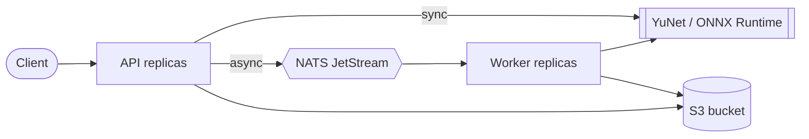

# Face Detection Service

[](https://github.com/chan4kum/opencv-face-detection/actions/workflows/ci.yml)
[](https://github.com/chan4kum/opencv-face-detection/actions/workflows/codeql.yml)
[](LICENSE)


A production-grade, horizontally scalable face detection service. It started as a 40-line OpenCV Haar-cascade webcam
script and was rebuilt as a real service: modern model, hardened API, distributed job pipeline, observability, Helm chart, CI/CD.

* **Model:** [YuNet](https://github.com/opencv/opencv_zoo/tree/main/models/face_detection_yunet) (MIT, 230 KB) on **ONNX Runtime**: boxes, confidence and 5 landmarks, about 16 ms per image on one CPU thread.
* **API:** FastAPI. Synchronous `POST /v1/detect` and asynchronous `POST /v1/jobs`.
* **Distributed:** stateless API + workers over **NATS JetStream**, images in any **S3-compatible** store. Scale API and workers independently.
* **Cloud-agnostic and open source end to end:** Docker, Kubernetes (Helm), Prometheus/Grafana, OpenTelemetry. Runs on any cloud or a laptop.
* **Secure by default:** hashed API keys, strict input validation, non-root read-only container, network policies, signed images.



Details: [docs/ARCHITECTURE.md](docs/ARCHITECTURE.md).

## Quick start

```bash
# 1. Full local stack: API, 2 workers, NATS, S3 (SeaweedFS), Prometheus, Grafana, Jaeger
docker compose --profile observability up -d --build --wait

# 2. Detect faces (synchronous)
curl -s -X POST localhost:8000/v1/detect -H 'Content-Type: image/jpeg' \
     --data-binary @tests/data/two_faces.jpg | jq '.faces | length'

# 3. Get the annotated image back
curl -s -X POST localhost:8000/v1/detect/annotated -H 'Content-Type: image/jpeg' \
     --data-binary @tests/data/two_faces.jpg -o annotated.jpg

# 4. Asynchronous job: submit, then poll
ID=$(curl -s -X POST localhost:8000/v1/jobs -H 'Content-Type: image/jpeg' --data-binary @tests/data/two_faces.jpg | jq -r .job_id)
curl -s localhost:8000/v1/jobs/$ID | jq
```

OpenAPI docs are served at `/docs` (disabled by default in the Helm chart). Grafana: http://localhost:3000, Jaeger: http://localhost:16686.

### Just the library / CLI (no servers)

```bash
uv sync
uv run face-detection detect photo.jpg -o annotated.jpg     # JSON on stdout
uv run face-detection webcam                                 # live demo (needs GUI OpenCV, see below)
```

```python
import cv2
from face_detection.detector import YuNetDetector
from face_detection.config import DEFAULT_MODEL_SHA256
from pathlib import Path

detector = YuNetDetector(Path("models/face_detection_yunet_2026may.onnx"), expected_sha256=DEFAULT_MODEL_SHA256)
for face in detector.detect(cv2.imread("photo.jpg")):
    print(face.x, face.y, face.width, face.height, face.score, face.landmarks)
```

> The webcam demo needs a GUI-enabled OpenCV. The service uses `opencv-python-headless`; for the demo run
> `uv pip uninstall opencv-python-headless && uv pip install opencv-python`.

## API

| Endpoint | Description |
|---|---|
| `POST /v1/detect` | Body = raw image bytes (`image/jpeg`, `image/png`, `image/webp`, `image/bmp`). Returns faces with `box`, `score`, `landmarks`. |
| `POST /v1/detect/annotated` | Same input; returns a JPEG with boxes and landmarks drawn (`X-Face-Count` header). |
| `POST /v1/jobs` | Queue an image; `202` with `job_id`. |
| `GET /v1/jobs/{id}` | `queued` / `processing` / `succeeded` (with `result`) / `failed` (with `error`). Only the submitting API key can read it. |
| `GET /v1/model` | Loaded model name, checksum and execution providers. |
| `GET /healthz`, `/readyz`, `/metrics` | Liveness, readiness (model, NATS, object storage), Prometheus metrics. |

Errors are [RFC 9457](https://www.rfc-editor.org/rfc/rfc9457) `application/problem+json` with a `request_id`.
Authentication: `Authorization: Bearer <key>` (generate with `face-detection keygen`; only the SHA-256 digest is configured).

<details><summary>Example response</summary>

```json
{
  "image": {"width": 512, "height": 512},
  "faces": [{
    "box": {"x": 178.0, "y": 63.0, "width": 90.0, "height": 113.0},
    "score": 0.937,
    "landmarks": {"right_eye": {"x": 205.4, "y": 107.3}, "left_eye": {"x": 244.7, "y": 107.6},
                  "nose": {"x": 226.1, "y": 128.2}, "right_mouth": {"x": 207.9, "y": 152.4}, "left_mouth": {"x": 241.5, "y": 152.7}}
  }],
  "inference_ms": 13.4,
  "model": {"name": "yunet-2026may", "sha256": "ebafce4e...", "execution_providers": ["CPUExecutionProvider"]},
  "request_id": "9b1d..."
}
```
</details>

## Configuration

All settings are environment variables prefixed `FD_`, validated at start-up (the process refuses to start on invalid
configuration). The important ones:

| Variable | Default | Purpose |
|---|---|---|
| `FD_ENVIRONMENT` | `dev` | `prod` requires `FD_API_KEY_HASHES` (or explicit `FD_AUTH_DISABLED=true`) |
| `FD_API_KEY_HASHES` | *(empty)* | Comma-separated SHA-256 digests of accepted keys |
| `FD_SCORE_THRESHOLD` / `FD_NMS_THRESHOLD` | `0.7` / `0.3` | Detection thresholds |
| `FD_INFERENCE_MAX_SIDE` | `960` | Longest side fed to the network |
| `FD_MAX_UPLOAD_BYTES` / `FD_MAX_IMAGE_PIXELS` | 10 MiB / 40 MP | Request limits |
| `FD_MAX_CONCURRENT_INFERENCE` | `4` | Concurrent inferences per process before load shedding (503) |
| `FD_ASYNC_ENABLED` | `false` | Enable the job API (needs NATS + S3) |
| `FD_NATS_URL`, `FD_S3_*` | see `config.py` | Backing services (any S3-compatible endpoint, or IAM roles on AWS) |
| `OTEL_EXPORTER_OTLP_ENDPOINT` | *(unset)* | Enables tracing |

Complete reference with types and bounds: [`src/face_detection/config.py`](src/face_detection/config.py).

## Deploy

* **Docker Compose:** above.
* **Kubernetes:** `helm install` the chart in [`deploy/helm/face-detection`](deploy/helm/face-detection): HPA or KEDA (queue-lag) autoscaling,
  PodDisruptionBudgets, NetworkPolicies, ServiceMonitor, PrometheusRule, Grafana dashboard.
* **Guide + production checklist + AWS mapping (IRSA, S3, EKS):** [docs/DEPLOYMENT.md](docs/DEPLOYMENT.md).

## Measured behaviour

Everything below was measured or exercised on the code in this repository (Apple M4 Pro, Docker Desktop, one API container,
512x512 JPEG with one face, one ONNX thread per request, `FD_MAX_CONCURRENT_INFERENCE=4`; reproduce with `make bench`):

| Client concurrency | Throughput | p50 | p95 | p99 | Errors |
|---|---|---|---|---|---|
| 1 | 61 req/s | 15.9 ms | 18.2 ms | 23.8 ms | 0 |
| 4 | 243 req/s | 15.8 ms | 21.4 ms | 26.0 ms | 0 |
| 16 | 296 req/s | 51.9 ms | 64.4 ms | 91.0 ms | 0 |

Latency stays flat until the 4 inference slots are full, then requests queue (and beyond `FD_INFERENCE_QUEUE_TIMEOUT_S` are shed with 503).
Numbers are for this hardware and image; benchmark your own workload and instance types before capacity planning.

## Verification status

| Area | How it was verified | Result |
|---|---|---|
| Detector correctness | Parity test against OpenCV's reference YuNet implementation (same weights) + coordinate tests under resize/pad/clip | identical detections and scores |
| Unit tests | `pytest -m "not integration"` (detector, imaging, config, API, auth, worker delivery semantics, storage via moto, CLI) | 105 passed |
| Integration tests | Real NATS JetStream 2.12 + SeaweedFS S3: job lifecycle, decoupled API/worker, permanent failure, tenant isolation, 24 jobs over 2 workers, graceful stop, prompt bus shutdown, worker app probes | 12 passed (about 10 s) |
| Container | Built and run as non-root, read-only rootfs, all capabilities dropped; auth, detection, JSON logs, graceful shutdown | works |
| Compose stack | All 10 services healthy; Prometheus scraping 4 targets, 6 alert rules loaded, Grafana dashboard provisioned, **one Jaeger trace spans API and worker** | works |
| Kubernetes | Installed and upgraded with the Helm chart on a real (kind) cluster with bundled NATS; rolling update; `helm test`; authenticated requests; 40 jobs with a worker force-killed and NATS restarted; 50 jobs queued with workers scaled to zero, NATS restarted, workers restored | 40/40 and 50/50 succeeded, none lost |
| Helm chart | `helm lint --strict`; 8 value combinations rendered; all documents valid | passes |
| CI workflows | `actionlint` clean | **not yet run on GitHub** |

**Not verified here (be aware before relying on it):** KEDA and prometheus-operator resources render but were not applied to a
cluster with those CRDs installed; NetworkPolicy enforcement depends on your CNI; multi-arch image build, cosign signing, SBOM
and the OCI chart push run only in the release workflow; GPU execution providers; behaviour under sustained multi-node load;
accuracy on your data (see [MODEL_CARD.md](docs/MODEL_CARD.md)).

## Development

```bash
uv sync --all-groups && uv run pre-commit install
make lint            # ruff, ruff format, mypy --strict
make test            # unit tests
make up              # local stack
make test-integration
```

See [CONTRIBUTING.md](CONTRIBUTING.md). Operations: [docs/RUNBOOK.md](docs/RUNBOOK.md). Security: [SECURITY.md](SECURITY.md).
Design decisions: [docs/adr](docs/adr). Model, limits and responsible use: [docs/MODEL_CARD.md](docs/MODEL_CARD.md).

## Project layout

```
src/face_detection/   detector, imaging, API (api/), worker, jobs (NATS), storage (S3), config, telemetry, CLI
tests/                unit + integration tests, real image fixtures
models/               vendored YuNet ONNX + license + provenance
deploy/helm/          Helm chart          deploy/compose/, deploy/images/   local stack config
deploy/prometheus/    alert rules         deploy/kind/                      local Kubernetes test
docs/                 architecture, deployment, runbook, model card, ADRs
.github/workflows/    CI, CodeQL, release (signed multi-arch image + chart)
```

## License

MIT for this repository. The bundled YuNet model is MIT-licensed (Copyright (c) 2020 Shiqi Yu); see [models/LICENSE](models/LICENSE).
