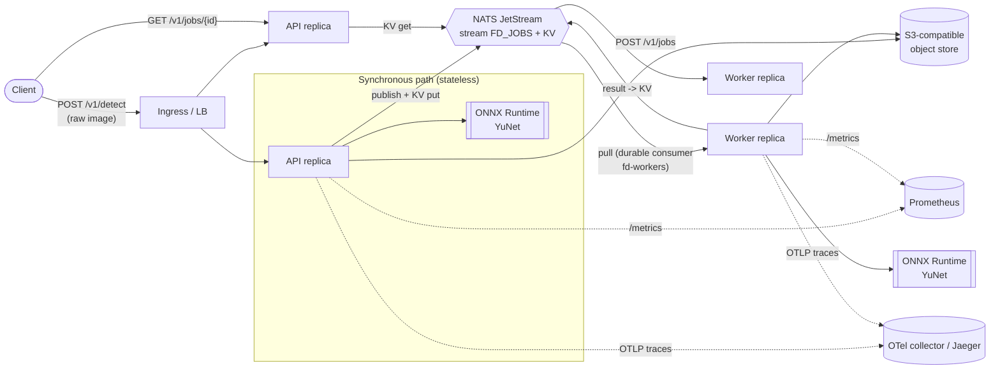

# Architecture

## Overview

Two ways to use the service:

| Path | Use when | Flow |
|---|---|---|
| **Synchronous** `POST /v1/detect` | Interactive, single images, latency matters | Validate, decode, infer, respond. No external dependencies besides the model. |
| **Asynchronous** `POST /v1/jobs` | Batches, bursts, large volumes, or clients that can poll | Upload to object store, enqueue on JetStream, return `202`; workers process; client polls `GET /v1/jobs/{id}`. |

## Components

| Component | Responsibility | Scaling unit |
|---|---|---|
| **API** (`face_detection.api.app`) | HTTP, auth, validation, sync inference, job submission and status | Replicas behind a load balancer (HPA on CPU) |
| **Worker** (`face_detection.worker`) | Consume jobs, run inference, persist results | Replicas sharing one durable JetStream consumer (KEDA on consumer lag, or CPU HPA) |
| **NATS JetStream** | Work-queue stream (delivery, retry, ordering-free scale-out) and KV bucket (job state) | 1 node (dev) or 3-node cluster (prod, `replicas=3`) |
| **Object storage (S3 API)** | Holds uploaded images for async jobs; short-lived | Managed service or self-hosted (SeaweedFS, MinIO, Ceph, R2, AWS S3) |
| **Model** (YuNet ONNX, 230 KB) | Face boxes + 5 landmarks | Baked into the image, checksum-verified on start |

The API and worker are the **same image and codebase**, started with different commands. The API holds no state,
so any replica can answer any request, including `GET /v1/jobs/{id}` for a job submitted through another replica.

## Inference

1. Header-only validation (format allow-list, pixel budget) *before* decoding, which defeats decompression bombs.
2. Decode with OpenCV (EXIF orientation applied; all coordinates refer to the upright image).
3. Down-scale so the longest side is at most `FD_INFERENCE_MAX_SIDE` (aspect ratio preserved, never upscaled),
   pad to a multiple of 32.
4. ONNX Runtime forward pass, decode the 12 raw outputs (3 strides x cls/obj/bbox/keypoints), score = sqrt(cls x obj).
5. Score threshold, NMS, clip to image bounds, rescale to original pixels.

The decoder is verified against OpenCV's own YuNet implementation in the test suite (identical detections and scores).

## Failure handling and delivery semantics

* **At-least-once delivery.** JetStream redelivers un-acked messages after `FD_JOB_ACK_WAIT_S`.
  Handlers are **idempotent**: a redelivered job whose record is already terminal is acknowledged and skipped.
* **Persist before acknowledge.** A worker writes the job outcome to the KV bucket *before* acking the message.
  If that write fails, the message is not acked and is retried.
* **Permanent vs transient errors.** Bad input (corrupt image, missing object) marks the job `failed` immediately
  with a client-safe message. Infrastructure errors are `nak`'d with linear back-off up to
  `FD_JOB_MAX_DELIVER` attempts, then marked `failed` ("processing failed after retries" and a
  `failed_exhausted` metric, which pages).
* **Poison messages** (unparseable) are terminated, not retried.
* **Load shedding.** The API bounds concurrent inference (`FD_MAX_CONCURRENT_INFERENCE`) and answers `503` with
  `Retry-After` when a request cannot get a slot within `FD_INFERENCE_QUEUE_TIMEOUT_S`, instead of queueing unboundedly.
* **Graceful shutdown.** SIGTERM flips `/readyz` to 503, workers stop pulling and finish in-flight jobs (bounded by
  `--timeout-graceful-shutdown`), then disconnect. Kubernetes `preStop` sleep lets endpoints drain first.
* **Backing-service outages.** NATS reconnects indefinitely; readiness reports the outage so traffic is withheld.

## Data handling

* Uploaded images are stored only for async jobs, under `inputs/<job-id>`, and **deleted after processing**
  (`FD_DELETE_INPUT_AFTER_PROCESSING`, default true). A bucket lifecycle rule (installed by `face-detection init-storage`)
  expires orphaned objects after 1 day.
* Job records (boxes/landmarks/scores, never pixels) live in the KV bucket with a TTL (`FD_JOB_TTL_S`, default 1 h).
* Jobs are owned by the API key that created them; other keys get `404`, so IDs are not disclosed across tenants.
* The service does not perform face *recognition* or store biometric templates. See [MODEL_CARD.md](MODEL_CARD.md).

## Observability

* **Metrics** (`/metrics`, Prometheus): request rate/latency/errors by route *template*, in-flight requests, inference latency,
  faces per image, load-shedding and rejection counters, job outcomes and end-to-end latency, build info.
  A Grafana dashboard and Prometheus alert rules ship in `deploy/`.
* **Tracing** (OpenTelemetry, off unless `OTEL_EXPORTER_OTLP_ENDPOINT` is set): HTTP spans, inference span, and W3C
  trace context propagated through NATS headers, so one trace covers API -> queue -> worker.
* **Logs**: structured JSON to stdout with `request_id`, `trace_id`, `span_id`.

## Scaling notes

* Each request uses one ONNX Runtime thread (`FD_ORT_INTRA_OP_THREADS=1`); throughput scales by adding replicas or
  raising `FD_MAX_CONCURRENT_INFERENCE` with CPU. One process per container by design (the Prometheus registry is per process).
* Worker scaling signal is queue depth: KEDA `nats-jetstream` scaler on the consumer lag.
* GPU: `providers` is a constructor argument of `YuNetDetector`; a CUDA/TensorRT build of ONNX Runtime can be used by
  changing the base image and passing the provider list. Not shipped or tested here (the model is small; CPU is sufficient for most loads).
